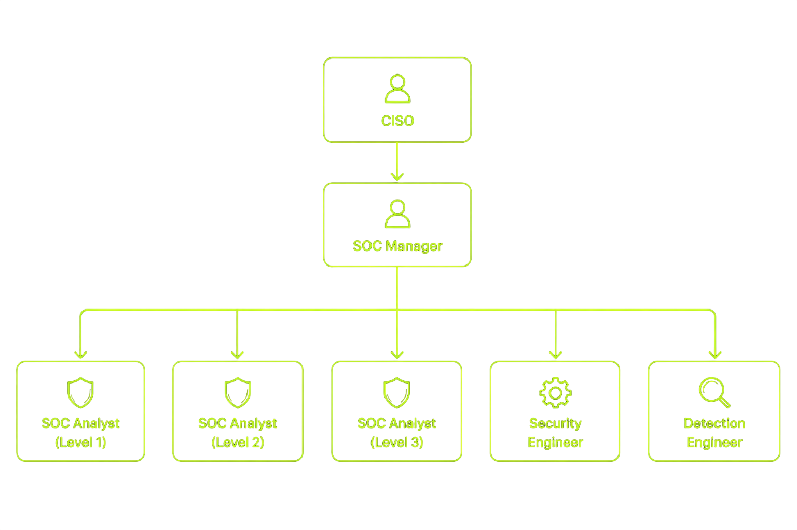

## 📍 Introduction

Today I attended a live SOC training session where the instructor explained how a Security Operations Center (SOC) actually works in real-world scenarios. This session was not just theoretical — it focused on mindset, workflow, and how beginners should approach cybersecurity.

```markdown
> If you treat this like a free course, you won’t get results.
> Treat it seriously to become job-ready.
```


## What is SOC (Security Operations Center)?

SOC is not a job role.

A **Security Operations Center (SOC)** is a centralized environment where a team of security professionals continuously monitors systems to detect and respond to cyber threats.

* 24×7 monitoring
* Multiple shifts
* Team-based environment


## Why SOC is Important for Freshers

SOC L1 acts as an **entry point into cybersecurity**.

* Incident Response
* Threat Intelligence
* Security Engineering
* Management roles

👉 SOC is a gateway into cybersecurity.


## Real Responsibilities of SOC L1 Analyst

SOC L1 is the **first responder**.

* Monitor alerts (SIEM, EDR)
* Perform initial investigation (triage)
* Identify true/false alerts
* Escalate to L2/L3
* Document everything

```markdown
> Every detected threat passes through L1 first.
```


## Daily Tasks in Real Environment

* Malware detection
* Phishing analysis
* Ransomware response support
* Improving detection rules


## 🔐 Core Concept: People, Process, Technology

### 👥 People
<br>
<div class="soc-list">
  <div class="soc-row">
    <span>1. L1 Analyst</span>
    <div class="soc-panel">
      • Alert monitoring <br>
      • First-level triage <br> 
      • Reports incidents <br>
      👉 <b>Think:</b> First responder
    </div>
  </div>

  <div class="soc-row">
    <span>2. L2 Analyst</span>
    <div class="soc-panel">
      • Deep investigation <br>
      • Log correlation <br>
      • Supports L1 <br>
      👉 <b>Think:</b> Investigator
    </div>
  </div>

  <div class="soc-row">
    <span>3. L3 Analyst</span>
    <div class="soc-panel">
      • Critical incident handling <br>
      • Response & recovery <br>
      • Advanced detection  <br>
      👉 <b>Think:</b> Expert
    </div>
  </div>

  <div class="soc-row">
    <span>4. Security Engineer</span>
    <div class="soc-panel">
      • Tool deployment <br>
      • System configuration <br>
      • Infra management  <br>
      👉 <b>Think:</b> Builder
    </div>
  </div>

  <div class="soc-row">
    <span>5. Detection Engineer</span>
    <div class="soc-panel">
      • Rule creation <br>
      • Attack detection <br>
      • SIEM tuning  <br>
      👉 <b>Think:</b> Rule creator
    </div>
  </div>

  <div class="soc-row">
    <span>6. SOC Manager</span>
    <div class="soc-panel">
      • Team management <br>
      • Process control <br>
      • Reports to CISO  <br>
      👉 <b>Think:</b> Leader
    </div>
  </div>

  <div class="soc-row">
    <span>7. CISO</span>
    <div class="soc-panel">
      • Security strategy <br>
      • Decision making  <br>
      • Org-level control <br>
      👉 <b>Think:</b> Head
    </div>
  </div>
</div>


### ⚙️ Process
<br>
<div class="soc-list">

  <div class="soc-row">
    <span>1. Alert Triage</span>
    <div class="soc-panel">
      • Analyze incoming alerts<br>
      • Identify true vs false positives<br>
      • Prioritize based on severity<br><br>
      👉 <b>Think:</b> Filter & classify threats
    </div>
  </div>

  <div class="soc-row">
    <span>2. Reporting</span>
    <div class="soc-panel">
      • Document incidents<br>
      • Share findings with team<br>
      • Maintain logs for tracking<br><br>
      👉 <b>Think:</b> Communicate clearly
    </div>
  </div>

  <div class="soc-row">
    <span>3. Incident Response</span>
    <div class="soc-panel">
      • Contain the threat<br>
      • Remove malicious activity<br>
      • Recover affected systems<br><br>
      👉 <b>Think:</b> Stop & fix the attack
    </div>
  </div>

  <div class="soc-row">
    <span>4. Forensics</span>
    <div class="soc-panel">
      • Investigate root cause<br>
      • Collect digital evidence<br>
      • Analyze attacker behavior<br><br>
      👉 <b>Think:</b> Understand the attack
    </div>
  </div>

</div>

<!-- 
#### 2.1 5W Rule -->
#### 🔎 2.1 5W Rule

<br>
<div class="soc-list">

  <div class="soc-row">
    <span>• What happened?</span>
    <div class="soc-panel">
      Identify the type of incident<br>
      Example: Malware, phishing, brute-force<br><br>
      👉 <b>Goal:</b> Understand the event
    </div>
  </div>

  <div class="soc-row">
    <span>• When did it happen?</span>
    <div class="soc-panel">
      Check timestamps in logs<br>
      Helps build attack timeline<br><br>
      👉 <b>Goal:</b> Track sequence of events
    </div>
  </div>

  <div class="soc-row">
    <span>• Where did it happen?</span>
    <div class="soc-panel">
      Identify affected system or network<br>
      Example: Endpoint, server, IP<br><br>
      👉 <b>Goal:</b> Locate the source
    </div>
  </div>

  <div class="soc-row">
    <span>• Who was involved?</span>
    <div class="soc-panel">
      Identify users, attackers, accounts<br>
      Check login/user activity<br><br>
      👉 <b>Goal:</b> Find responsible entities
    </div>
  </div>

  <div class="soc-row">
    <span>• Why did it happen?</span>
    <div class="soc-panel">
      Analyze root cause<br>
      Example: vulnerability, misconfig<br><br>
      👉 <b>Goal:</b> Prevent future attacks
    </div>
  </div>

</div>


### 4. Technology

* SIEM
* EDR / XDR
* Firewalls
* Email Security Tools


##  SOC Hierarchy



## 💡 Key Points

* SOC is not a role, it’s an environment
* Best entry point for freshers
* Requires analytical thinking
* Based on People, Process, Technology
* 5W rule is critical
* Basics are more important than certificates


## 🚀 Conclusion

SOC L1 is the best starting point for beginners in cybersecurity. It builds real-world skills like monitoring, analysis, and incident response.

Focus on fundamentals and consistency — that’s the key to entering the industry.


## 📢 Call to Action

* Learn SOC fundamentals
* Practice daily
* Stay consistent

👉 Follow for more cybersecurity learning content.

```markdown
> Strong basics + consistency = SOC job readiness
```
